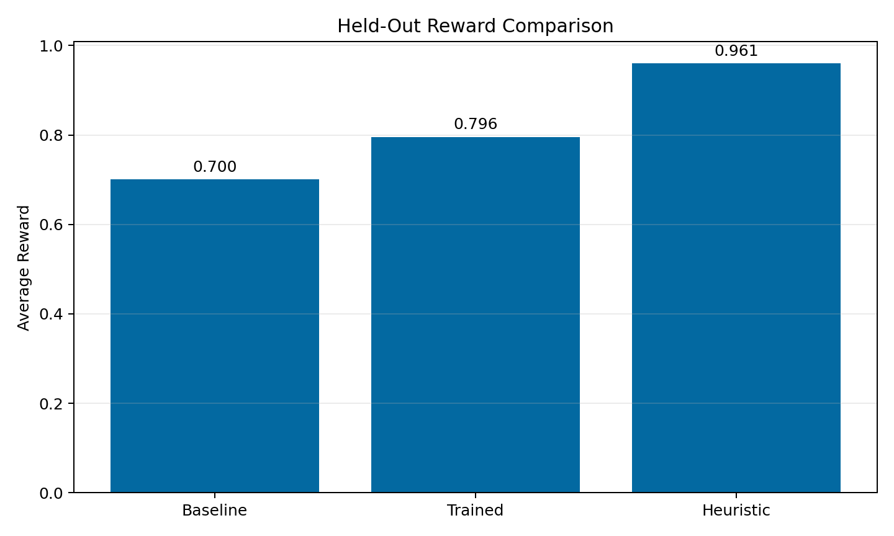
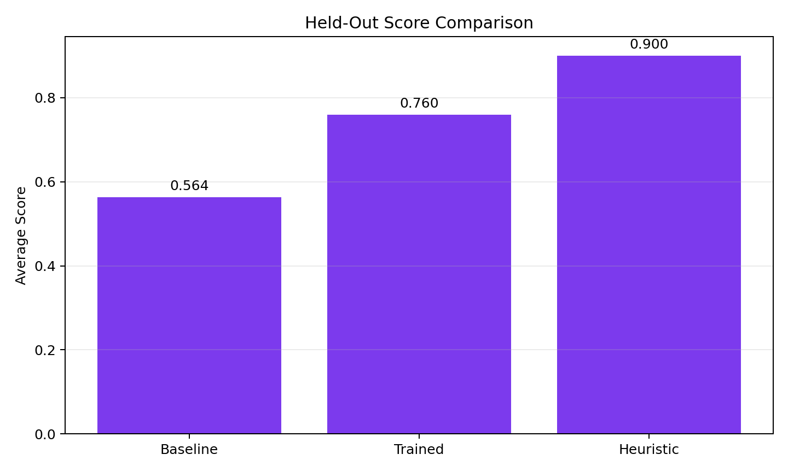

# PhysioSupportEnv

PhysioSupportEnv is an OpenEnv-style RL environment for home physiotherapy care coordination. The agent reads a realistic patient support case, produces one structured care decision, and gets a deterministic reward based on safety, operational correctness, and communication quality.

This environment is intentionally narrow in domain but broad in implication. We use a home-physio coordination workflow as the first slice of a larger class of healthcare operations problems where an agent must make safe, structured, operationally valid decisions.

## Submission Deliverables

- Hugging Face Space: [shivansh9987/physio-support-openenv](https://huggingface.co/spaces/shivansh9987/physio-support-openenv)
- Training scripts:
  [phase6_train.py](phase6_train.py),
  [phase55_bootstrap_sft.py](phase55_bootstrap_sft.py),
  [train_scaffold.py](train_scaffold.py),
  [warmup_sft.py](warmup_sft.py)
- Training notebook: [phase6_training_notebook.ipynb](phase6_training_notebook.ipynb)
- Writeup / blog: [BLOG.md](BLOG.md)
- Final result bundle: [artifacts/phase6/final_results](artifacts/phase6/final_results)
- Submission package: [artifacts/submission_bundle](artifacts/submission_bundle)
- Environment manifest: [openenv.yaml](openenv.yaml)

Key committed training plots:

- [Reward curve PNG](artifacts/phase6/grpo_smoke/reward_curve.png)
- [Loss curve PNG](artifacts/phase6/grpo_smoke/loss_curve.png)
- [Reward comparison PNG](artifacts/phase6/final_results/reward_comparison.png)
- [Score comparison PNG](artifacts/phase6/final_results/score_comparison.png)

Inline preview for reviewers:


## What The Environment Trains

- booking correctness
- rescheduling correctness
- callback handling for worsening pain
- priority escalation for severe pain
- concise patient communication with useful therapist summaries

## Current Task Families

- `booking`
- `rescheduling`
- `callback`
- `priority_pain`

The repo currently includes five seeded cases covering standard booking, caregiver and access blockers, worsening-pain callbacks, critical pain escalation, and a mixed-intent pain plus reschedule case.

## OpenEnv Interface

- `reset()`
- `state()`
- `step(action)`

Each episode is one patient-care coordination case. The current setup evaluates one structured decision per episode.

## Observation Schema

Each state includes:

- `task_id`
- `task_family`
- `patient_message`
- `patient_history_summary`
- `care_plan_summary`
- `visit_context`
- `operational_constraints`
- `allowed_actions`
- `policy_constraints`
- `steps_taken`
- `episode_status`

## Output Schema

The model must return JSON in this shape:

```json
{
  "intent": "mixed_intent",
  "risk_level": "high",
  "next_action": "priority_callback",
  "secondary_actions": ["notify_therapist"],
  "patient_reply": "I'm sorry the pain has increased. I'm marking this as a priority callback so our team can contact you quickly.",
  "therapist_summary": "Patient reports worsening pain before the next visit. Priority callback triggered and therapist notified.",
  "risk_flag": "priority_pain_case"
}
```

## Supported Labels

Supported intents:

- `book_visit`
- `reschedule_visit`
- `cancel_visit`
- `request_callback`
- `report_worsening_pain`
- `ask_general_info`
- `caregiver_unavailable`
- `home_access_issue`
- `mixed_intent`

Supported actions:

- `confirm_home_visit`
- `reschedule_home_visit`
- `request_more_information`
- `schedule_callback`
- `priority_callback`
- `notify_therapist`
- `convert_to_remote_checkin`
- `modify_visit_plan`
- `escalate_for_clinical_review`
- `escalate_for_emergency_attention`
- `close_with_guidance`

## Reward Design

The reward engine in [app/grader.py](app/grader.py) uses weighted components:

- intent correctness: `0.15`
- risk classification correctness: `0.20`
- action correctness: `0.25`
- policy compliance: `0.10`
- logistics validity: `0.10`
- escalation correctness: `0.10`
- summary completeness: `0.05`
- patient reply quality: `0.05`

Penalties are applied for:

- schema failure
- unsafe failure to escalate
- invalid or forbidden actions
- contradiction between reply and selected action
- unnecessary clarification
- wrong risk flag

## Project Structure

- [app/env.py](app/env.py)
- [app/grader.py](app/grader.py)
- [app/models.py](app/models.py)
- [app/case_generator.py](app/case_generator.py)
- [app/evaluation.py](app/evaluation.py)
- [app/heuristic_policy.py](app/heuristic_policy.py)
- [app/model_policy.py](app/model_policy.py)
- [app/plotting.py](app/plotting.py)
- [app/prompting.py](app/prompting.py)
- [app/tasks.py](app/tasks.py)
- [app/training_data.py](app/training_data.py)
- [app/structured_output.py](app/structured_output.py)
- [inference.py](inference.py)
- [train_scaffold.py](train_scaffold.py)
- [evaluate.py](evaluate.py)
- [server/app.py](server/app.py)
- [openenv.yaml](openenv.yaml)

## Run Locally

```bash
python -m venv venv
venv\Scripts\activate
pip install -r requirements.txt
python demo_app.py
```

That launches the judge-facing Gradio demo on `http://localhost:7860`.

Optional environment variables for live model calls:

```powershell
$env:HF_TOKEN="your_token"
$env:OPENAI_API_KEY="your_token"
$env:API_BASE_URL="https://router.huggingface.co/v1"
$env:MODEL_NAME="katanemo/Arch-Router-1.5B:hf-inference"
```

Without API credentials, `inference.py` falls back to a deterministic heuristic policy so the environment still runs.

To run local adapter inference after fine-tuning:

```powershell
$env:LOCAL_BASE_MODEL="Qwen/Qwen2.5-0.5B-Instruct"
$env:LOCAL_ADAPTER_PATH="artifacts/training"
python inference.py
```

To launch the API server directly instead of the Gradio demo:

```bash
uvicorn server.app:app --host 0.0.0.0 --port 7860
```

## Training Scaffold

Run the LoRA fine-tuning scaffold:

```bash
python train_scaffold.py --base-model Qwen/Qwen2.5-0.5B-Instruct --num-train-epochs 3 --variants-per-task 8 --output-dir artifacts/training
```

What it does:

- expands each seeded task into deterministic train and eval variants
- builds an SFT dataset of observation to JSON decision examples
- fine-tunes a causal LM with `TRL` `SFTTrainer` and `PEFT` LoRA
- evaluates the untuned base model and the trained adapter with the same reward engine
- saves adapter checkpoints and reports under `artifacts/training`
- exports `reward_curve.svg` and `loss_curve.svg`

Key outputs:

- `data/train.jsonl`
- `data/eval.jsonl`
- `baseline_eval.json`
- `heuristic_eval.json`
- `trained_eval.json`
- `training_summary.json`
- `trainer_log_history.json`
- `reward_curve.svg`
- `loss_curve.svg`

## Evaluation Script

Evaluate the heuristic baseline:

```bash
python evaluate.py --policy heuristic --split eval --variants-per-task 8
```

Evaluate the untuned base model:

```bash
python evaluate.py --policy baseline --base-model Qwen/Qwen2.5-0.5B-Instruct --split eval --variants-per-task 8
```

Evaluate a trained adapter:

```bash
python evaluate.py --policy trained --base-model Qwen/Qwen2.5-0.5B-Instruct --adapter-path artifacts/training --split eval --variants-per-task 8
```

## Phase 6 RL Training

If you want a remote-friendly warm start before GRPO, train a bootstrap SFT adapter first:

```bash
python phase55_bootstrap_sft.py --base-model Qwen/Qwen2.5-0.5B-Instruct --output-dir artifacts/phase55/bootstrap_sft --variants-per-task 8
```

What this does:

- fine-tunes a LoRA adapter on the structured target JSON outputs
- saves a reusable PEFT adapter for downstream RL
- exports bootstrap schema metrics and checkpoints

For the real Phase 6 training story, use the environment-connected GRPO loop:

```bash
python phase6_train.py --base-model Qwen/Qwen2.5-0.5B-Instruct --output-dir artifacts/phase6/grpo_training --variants-per-task 8 --num-train-epochs 2 --num-generations 4 --bootstrap-adapter-path artifacts/phase55/bootstrap_sft
```

To run the full bootstrap-plus-GRPO pipeline in one HF job, use:

```bash
python phase6_train.py --base-model Qwen/Qwen2.5-0.5B-Instruct --output-dir artifacts/phase6/grpo_training --variants-per-task 8 --num-train-epochs 1 --num-generations 4 --bootstrap-auto
```

What this does:

- builds prompt-only train cases from the environment task bank
- can first train a bootstrap SFT adapter under `bootstrap_sft/` and reuse it automatically
- samples completions from the model instead of replaying teacher labels
- scores each completion with `PhysioSupportEnv` through the real reward engine
- updates the model with `TRL` `GRPOTrainer` against environment reward
- saves baseline, trained, and heuristic evaluations in the same artifact format

This is the correct Phase 6 path for the submission claim that the agent improved through environment feedback.

## Phase 6 Results

The current best result comes from the successful HF Job `69ecb239d70108f37acde5a1`, reconstructed locally under [artifacts/phase6/final_results](artifacts/phase6/final_results).

Held-out eval comparison on 10 cases:

| Policy | Avg Reward | Avg Score | Risk Acc | Action Acc | Priority Recall | Unsafe Rate |
| --- | ---: | ---: | ---: | ---: | ---: | ---: |
| Baseline Qwen2.5-0.5B | `0.7003` | `0.5635` | `0.70` | `0.60` | `0.50` | `0.00` |
| Trained Phase 6 Adapter | `0.7958` | `0.7598` | `1.00` | `0.70` | `1.00` | `0.00` |
| Heuristic Teacher | `0.9605` | `0.9000` | `1.00` | `0.80` | `1.00` | `0.00` |

Main improvements from baseline to trained adapter:

- average reward: `+0.0955`
- average score: `+0.1963`
- risk accuracy: `+0.30`
- action accuracy: `+0.10`
- priority pain recall: `+0.50`
- unsafe action rate stayed at `0.00`

Committed result files:

- [training_summary.json](artifacts/phase6/final_results/training_summary.json)
- [baseline_eval.json](artifacts/phase6/final_results/baseline_eval.json)
- [trained_eval.json](artifacts/phase6/final_results/trained_eval.json)
- [heuristic_eval.json](artifacts/phase6/final_results/heuristic_eval.json)
- [reward_comparison.svg](artifacts/phase6/final_results/reward_comparison.svg)
- [score_comparison.svg](artifacts/phase6/final_results/score_comparison.svg)
- [reward_comparison.png](artifacts/phase6/final_results/reward_comparison.png)
- [score_comparison.png](artifacts/phase6/final_results/score_comparison.png)





## Why This Matters

We selected a focused physiotherapy support workflow because it is realistic, safety-sensitive, and feasible to model within hackathon constraints. The broader scope is much larger: if an agent can learn structured routing, escalation, scheduling, and communication in this setting, the same pattern can extend to wider healthcare operations and patient-support workflows.

This project therefore matters not only as a niche demo, but as a blueprint for operational AI systems that assist teams handling patients, appointments, callbacks, summaries, and workflow decisions at scale.

## API

The Docker Space now launches the Gradio demo by default. The FastAPI server is still available for programmatic evaluation and manual endpoint testing.

Start the API server manually:

```bash
uvicorn server.app:app --host 0.0.0.0 --port 7860
```

Useful endpoints:

- `GET /health`
- `GET /tasks`
- `POST /reset`
- `GET /state/{session_id}`
- `POST /step/{session_id}`
- `POST /run_inference/{task_id}`

`POST /step/{session_id}` expects the same structured JSON shown in the output schema section.

## Current Status

The environment and evaluation path are wired, and the repo now includes both bootstrap SFT and real environment-reward Phase 6 training paths:

- structured task observations
- PRD-aligned response schema
- deterministic reward breakdown
- safety penalties for missed escalation
- inference runner and FastAPI endpoints updated to the new contract
- runnable `TRL` + `PEFT` bootstrap LoRA training scaffold
- runnable `TRL` `GRPOTrainer` Phase 6 environment-reward training path
- shared evaluation metrics for reward, intent, risk, action, callback, priority recall, and unsafe rate
- base-model vs trained-adapter evaluation with the same artifact format
- committed Phase 6 final result bundle under `artifacts/phase6/final_results`
- PNG and SVG comparison plots for the final submitted metrics
- submission-ready package under `artifacts/submission_bundle`
